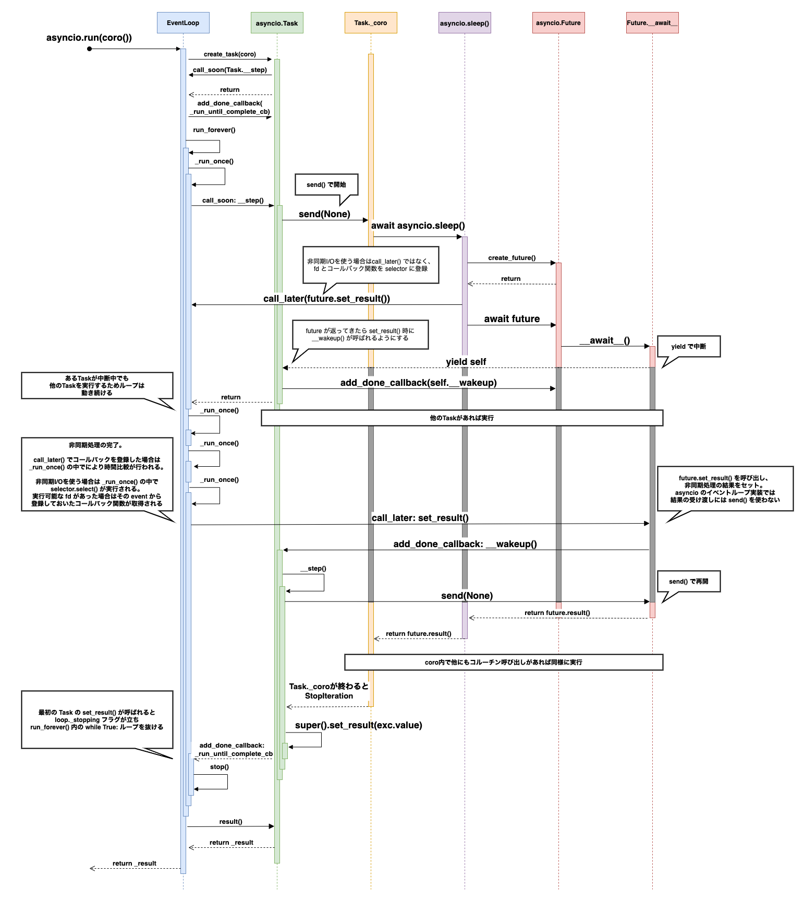

[PyCon JP 2021](https://2021.pycon.jp/)の資料です。

* [セッション](https://2021.pycon.jp/time-table/?id=272959)
* [発表資料](https://docs.google.com/presentation/d/1qRmMGfTRvAfdJFCHpZhcTwsiJeu2yIO70CcnfPmZzfE/edit#slide=id.p)
* [動画]()

