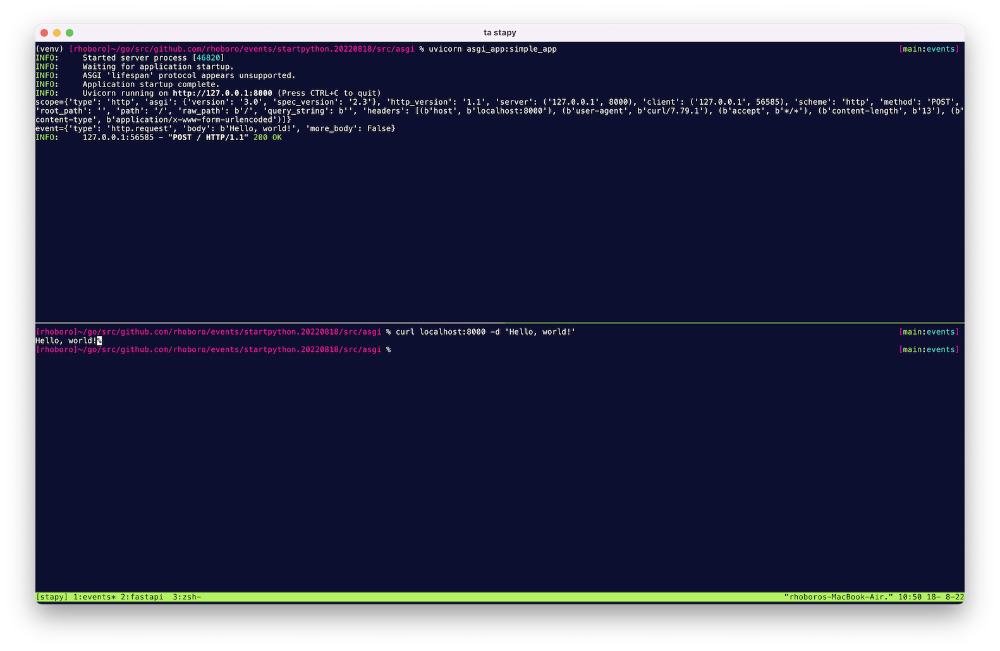

```sh
$ python3 -m venv venv
$ . venv/bin/activate
(venv) $ pip install -r requirements.lock
(venv) $ uvicorn asgi_app:simple_app
INFO:     Started server process [46054]
INFO:     Waiting for application startup.
INFO:     ASGI 'lifespan' protocol appears unsupported.
INFO:     Application startup complete.
INFO:     Uvicorn running on http://127.0.0.1:8000 (Press CTRL+C to quit)
```

```sh
$ curl localhost:8000 -d 'Hello, world!'
Hello, world!
```


