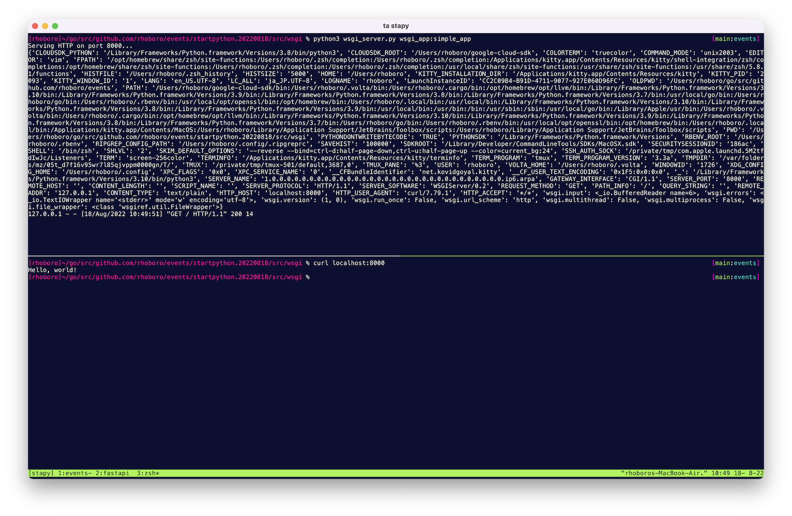

```sh
$ python3 wsgi_server.py --help
usage: wsgi_server.py [-h] [-p P] app

positional arguments:
  app         module:app_name

options:
  -h, --help  show this help message and exit
  -p P        port

$ python3 wsgi_server.py wsgi_app:simple_app
Serving HTTP on port 8000...
```

```sh
$ curl localhost:8000
Hello, world!
```


